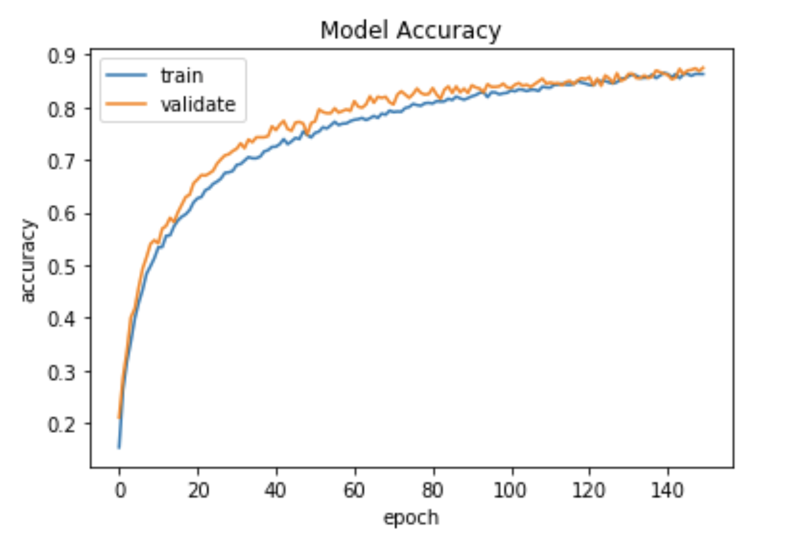

# Audio Classification

## Project Overview
This project is instructed by Prof. Chris Kyriakakis, USC.

The objective of the project is to build and train a model to identify urban sound. Due to the limitation of the obtained dataset, the Neural Network model is able to identify 10 types of sound including:  
0 = air_conditioner  
1 = car_horn  
2 = children_playing  
3 = dog_bark  
4 = drilling  
5 = engine_idling  
6 = gun_shot  
7 = jackhammer  
8 = siren  
9 = street_music  

## Package Needed
Keras  
TensorFlow  
pickle  
librosa  
struct  
sklearn  
datetime  
matplotlib  
os  
  
Setting up a virtual environment and install the required packages in the virtual environment is recommended. So different projects will not affect each other.

## File Structure
1. [Audio Classification.ipynb](./Audio&#32;Classification.ipynb) is the main file with all the functions, model definitions and most of the results.  
2. [sound_classification_model.json](./sound_classification_model.json) is the Model object where the Neural Network is defined and store to .h5 file to avoid repeated model compilation.  
3. [weights.best.basic_cnn.hdf5](./weights.best.basic_cnn.hdf5) is the file that contains the weight used in the model. So we can quickly continue the progress to do a prediction.
4. [UrbanSound8K](./UrbanSound8K) is the dataset obtained online to train the Neural Network model. The description of this dataset can be found in [README](./UrbanSound8K/UrbanSound8K_README.txt) file of its folder.  
The dataset folder is not included in this GitHub repository, but can be downloaded from https://urbansounddataset.weebly.com/urbansound8k.html.
5. [audio_features_mfcc40.pickle](./audio_features_mfcc40.pickle) is the pre-processed data file. Processing the data can take 15 minutes up, store the pre-processed data is important to save time. 

This file is not included in this GitHub repository, but can generate a new one by running save_data() function in main file.

**In order to make the program run correctly, the UrbanSound8K folder should be unchanged and stayed in the main folder. The rest of the files need to be in the same folder as the notebook file. Otherwise, the paths reference to some of the files in the notebook need to be adjusted accordingly.**

## Code Structure
All the code is contained in a jupyter notebook file named "Audio Classification.ipynb".  
1. The first cell is used to import libraries.  
2. Cell 2 to 7 is used to extract the audio information and store them into local variables for the later part of the functions to use. Also, the file is pre-processed and stored in pickle file for easy access next time.  
3. Cell 8 to 12 is used to build Neural Network models in Keras. Note that there are 2 models, one is LaNet-5 like CNN model and the other is MobileNet model. Only the LaNet-5 like model works, the MobileNet model is experimented to improve accuracy but did not work.  
4. Cell 13 to 19 is used to train and evaluate the model using the pre-processed data.  
5. Cell 20 is used to store the model and the trained weights.  
6. The cells after cell 20 is used to extract the previously built and trained model (another time when you open the jupyter notebook) and then use the model to make prediction on user uploaded data.  

## How to Use
The entire notebook contains the functions to pre-process the specified dataset, define a Convolutional Neural Network Model and to train the model with the data. The model and the trained weights are saved into specified files.

At the end of the notebook, you have a part that you can load the model and the pretrained weights. And use the next cell to load user specified sound clip. The sound clip needs to last about 2s, and the part containing information needs to be within the 2s part. 

## Data Pre-processing
The data pre-processing in this case is to turn the 1D audio signal to 2D (actually 3D, but the last dimension is 1) audio spectrum. This is done through Librosa library.

One critical parameter - the vertical dimension in the audio spectrum (the dimension n in the input spectrum n * 173 * 1) is experimented.  

  
As the image show, when the vertical dimension is 40 the model will have the highest accuracy. 

## Model Architecture
| Layer         		|     Description	        					| 
|:---------------------:|:---------------------------------------------:| 
| Input         		| 173x40x1 Audio Spectrum   							| 
| Convolution 2x2     	| 1x1 stride, valid padding, filter size 16 	|
| RELU					|												|
| Max pooling	      	| 2x2 stride, valid padding 	|
| Dropout		 		|Droop rate 0.4									|
| Convolution 2x2     	| 1x1 stride, valid padding, filter size 32 	|
| RELU					|												|
| Max pooling	      	| 2x2 stride, valid padding 	|
| Dropout		 		|Droop rate 0.4									|
| Convolution 2x2     	| 1x1 stride, valid padding, filter size 64 	|
| RELU					|												|
| Max pooling	      	| 2x2 stride, valid padding  	|
| Dropout		 		|Droop rate 0.4									|
| Convolution 2x2     	| 1x1 stride, valid padding, filter size 128 	|
| RELU					|												|
| Max pooling	      	| 2x2 stride, valid padding 	|
| Dropout		 		|Droop rate 0.4									|
| Flatten				| faltten to 1 dimension			|
| Softmax				|Output layer using Softmax				|
  
Overall the model has 4 Convolutional blocks. Each block is consisted of a convolution layer followed by a ReLu activation layer. And then a Max pooling layer and a Dropout to regularize the output. Finally, there is a fully connected flatten layer with a Softmax activation. The model is a bit like the classic LeNet-5 model.

## Results

As the graph show, from training epoch of about 150 the accuracy improves very slowly. More epochs than 150 may cause over fitting. Thus, the training epoch is set to 150. A slightly lower number (~120) is also acceptable.

The achieved training accuracy is 92. 26%, the validation accuracy is 87. 51%, the test accuracy is 87. 13%.

## Unsuccessful Attempts
MobileNet model is attempted to be applied, but not successful. The dimension of the dataset seems to be inconsistent with the predefined model. The MobileNet model works best with square images (in this case audio spectrum), but the data we have is (40 * 173 * 1) which is very stretched. This could be the reason why MobileNet and most of other CNN models cannot be applied on this dataset. It is likely that CNN models won't work well on audio data even though the bug is fixed.

## Future Developments
As for the future development, you can either fix the issue with MobileNet (or other CNN networks) and have the model trained on the pre-processed data, or use an Recurrent Neural Network (RNN) model. It is much more effective to use RNN models on sequential data like audio or speech. Because RNN model can capture the sequential relation in the data, while CNN model does this poorly.

## Reference
[1] Mike Smales, Sound Classification using Deep Learning. Retrieved from https://medium.com/@mikesmales/sound-classification-using-deep-learning-8bc2aa1990b7

[2] Aakash Mallik, Audio signal feature extraction and clustering. Retrieved from https://medium.com/heuristics/audio-signal-feature-extraction-and-clustering-935319d2225

[3] TensorFlow Audio Recognition in 10 Minutes. Retrieved from https://data-flair.training/blogs/tensorflow-audio-recognition/

[4] Keras Documentation. Retrieved from https://keras.io/getting-started/sequential-model-guide/

[5] URBANSOUND8K DATASET. Retrieved from https://urbansounddataset.weebly.com/urbansound8k.html

## License
Private use only
